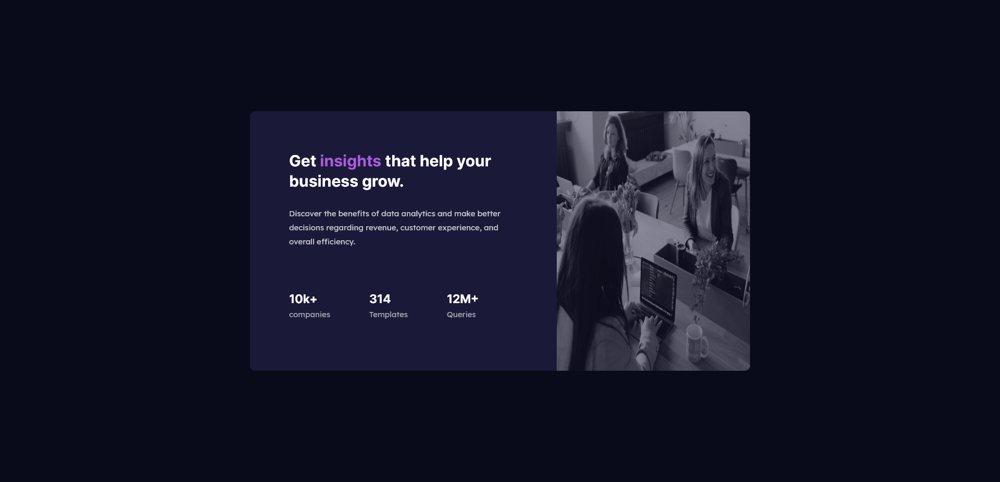

# Frontend Mentor - Stats preview card component solution

This is a solution to the [Stats preview card component challenge on Frontend Mentor](https://www.frontendmentor.io/challenges/stats-preview-card-component-8JqbgoU62). Frontend Mentor challenges help you improve your coding skills by building realistic projects.

## Table of contents

- [Overview](#overview)
  - [The challenge](#the-challenge)
  - [Screenshot](#screenshot)
  - [Links](#links)
- [My process](#my-process)
  - [Built with](#built-with)
  - [Continued development](#continued-development)
  - [Useful resources](#useful-resources)
- [Author](#author)

## Overview

### The challenge

Users should be able to:

- View the optimal layout depending on their device's screen size

### Screenshot

### Links

- Solution URL: [Add solution URL here](https://your-solution-url.com)
- Live Site URL: [Add live site URL here](https://adrianna450.github.io/stats-card/)

## My process

### Built with

- Semantic HTML5 markup
- CSS custom properties
- Flexbox
- Mobile-first workflow

### Continued development

I want to countine my learning of html and css so that I can have a better understanding of web development. I plan on moving on to javascript after making a couple more websites. I hope to be able to become a frontend developer.

### Useful resources

- [resource 1](https://flexbox.malven.co/) - This website gave me a simple referecne to flexboxes that I could look back on quickly.
- [resource 2](https://developer.mozilla.org/en-US/docs/Web/CSS) - Since I am learning Css over again, this was a helpful resource for looking up things that I forgot.

## Author

- Frontend Mentor - [@adrianna450](https://www.frontendmentor.io/profile/adrianna450)
